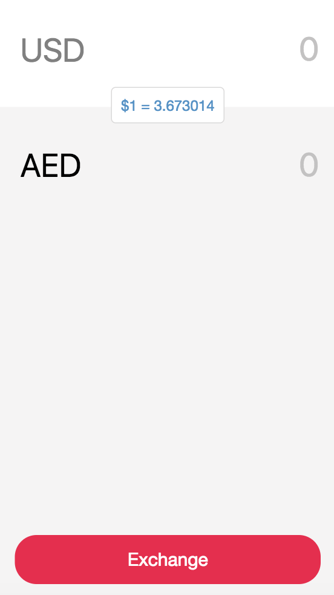

## Currency Exchange App



1. install node dependencies

```
npm i
```

2. run the server

```
node server
```

3. open http://localhost:8080/

note: current free api only support USD, if you want to support more currencies, you have to pay £12/month.